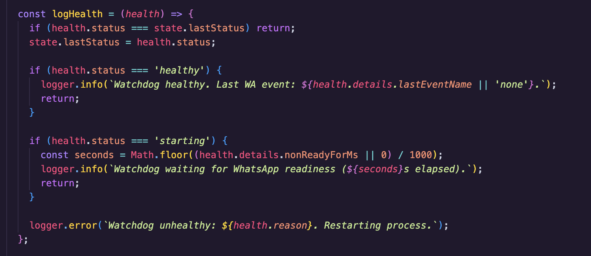

# Zimbabwe Theme Collection

<p align="center">
  
</p>

This collection started with a simple idea: your editor should feel like *somewhere*, not nowhere. Each palette is rooted in a real corner of Zimbabwe—the spray and basalt at the Falls, jacaranda haze over Harare, the warmth of Bulawayo stone, the colour and motion of Chitungwiza, the cool clarity of the Eastern Highlands. They were tuned slowly: contrast checked in long sessions, accents chosen so syntax stays legible, and chrome (tabs, side bar, status bar) balanced so the UI feels cohesive rather than loud.

If you live in these places, grew up around them, or just want your workspace to carry a bit of home (or curiosity), this is for you. Researched, tweaked, and shipped with love.

<p>
  
</p>


## Why people use it

- **Readable first** — palettes are stress-tested for real coding, not just screenshots.
- **Distinct personalities** — each city has its own temperature and story; you can switch mood without switching “quality.”
- **Honest places** — colours echo landscapes, seasons, and city life rather than generic “theme pack #47.”
- **Daily-driver friendly** — calm enough for long reviews, sharp enough for debugging and teaching.

## Installation

### From a VSIX release
1. Download the latest `.vsix` file from the project releases.
2. Open VS Code.
3. Go to `Extensions`.
4. Open the extensions menu and choose `Install from VSIX...`.
5. Select the downloaded package.

### From the terminal

### VS Code

```bash
code --install-extension /zimbabwe-theme-0.3.0.vsix
```

### Cursor

Cursor installs VS Code–compatible extensions the same way. From a terminal (with the [Cursor shell command](https://docs.cursor.com/) on your `PATH`):

```bash
cursor --install-extension ./zimbabwe-theme-0.3.0.vsix
```

Or in the app: **Extensions** → **⋯** → **Install from VSIX…** → choose the downloaded file.

If `cursor` is not found, open the Command Palette in Cursor and run **Shell Command: Install `cursor` command in PATH** (wording may vary slightly by version), then try the command again.

## Activate a Theme

1. Open the Command Palette with `Cmd/Ctrl + Shift + P`.
2. Run `Preferences: Color Theme`.
3. Pick a label (city + one-word vibe):
   - `Zimbabwe - Victoria Falls Gorge` / `Zimbabwe - Victoria Falls Mist`
   - `Zimbabwe - Harare Jacaranda` / `Zimbabwe - Harare Garden` / `Zimbabwe - Harare Copa Cabana`
   - `Zimbabwe - Chitungwiza Market` / `Zimbabwe - Chitungwiza Sunrise`
   - `Zimbabwe - Bulawayo Heritage` / `Zimbabwe - Bulawayo Sandstone` / `Zimbabwe - Bulawayo Vibe`
   - `Zimbabwe - Mutare Highlands`

## Support

If these themes make your day a little better, you can say thanks with a coffee on [Buy Me a Coffee](https://buymeacoffee.com/gtchakama).

